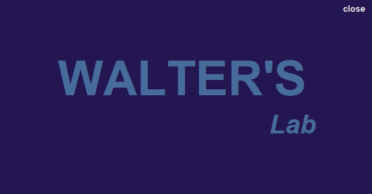
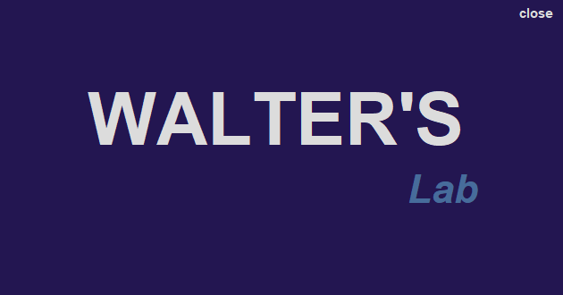
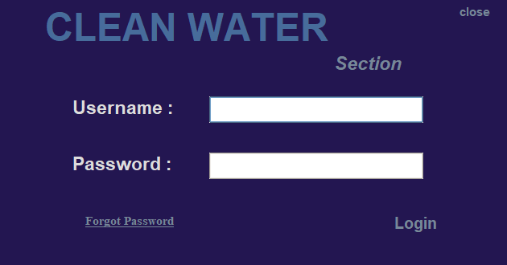
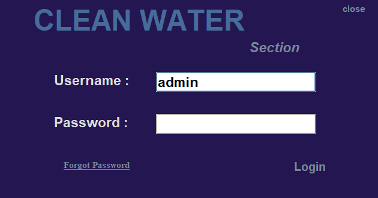
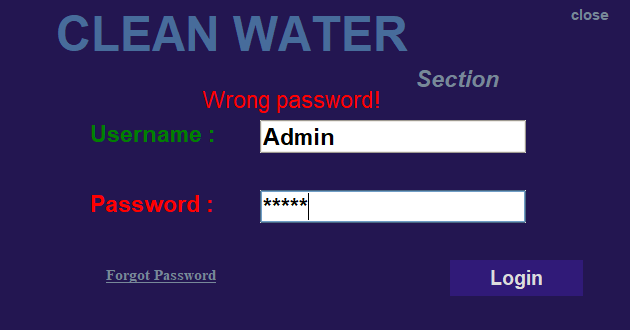
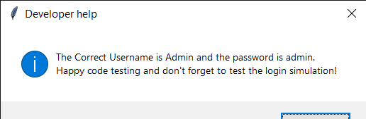

# PYTHON CODE SNIPPETS

##### These are a collection of short python scripts that I wrote  

----------

### SETUP
Clone the code from by writing this code into your console
```console
git pull 'https://github.com/pseudo-safariac/short_python_scripts.git/'
cd short_python_scripts
```
----------

## FEATURED CODE
1. [BMI calculator](#bmi-calculator)
2. [Tkinter Splashscreen](#tkinter-splashscreen)

## BMI calculator
The script is a simple program that calculates the [Body Mass Index](https://www.cdc.gov/nccdphp/dnpao/growthcharts/training/bmiage/page5_1.) (BMI) of a human adult. The calculation is based on Scientific research that is publicly available.

The function called receives two arguments;
- Height in metric centimetres
- Weight in metric kilograms

```python
bmi_calculation(height : float | int, weight : float | int) -> str | None
```
The function returns a string that has information on the BMI of the user.
An example of use is given below;
```python
>>> bmi_calculator.py
>>> Enter your height in cm:
163
>>> Enter weight in kg:
62.5

****************************************
        You are of normal weight
****************************************
```

A later update release will also feature an option to also receive the BMI index itself as an `integer|float`.

## Tkinter Splashscreen
This is my own personal rendition of a tkinter splashscreen. This was created purely using the [tkinter module](https://docs.python.org/3/library/tkinter.html).

To launch the script, simply run;

```python
python3 python_splashscreen.py
```

This runs to reveal the GUI;



On button click, the login page pops up;

### Features of the Splashscreen
- It has focusable buttons



- It has a functional Login Page



- It has a user-friendly input field with clear font



- It has inbuilt logic that the user can use for smooth login




- It has a *forgot password* option



> On successful Login, the GUI will fade out smoothly and the program will terminate
